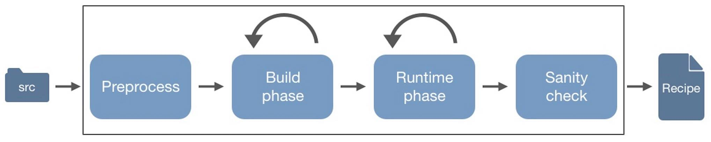

==============
How BiRG works
==============

BiRG is split into four phases: preprocess, build phase, runtime phase and sanity check.

++++++++++
Preprocess
++++++++++
The preprocess step only applies to the python build strategy at the moment. What BiRG does for python packages is to look for a setup.py file and if it finds it, BiRG runs `python setup.py sdist`. This outputs a requires.txt file, which hopefully contains most of the packages needed to build the given software. These packages are then added to the recipe before going to the next phase (and therefore reducing the overall running time).

+++++++++++
Build phase
+++++++++++
The build phase is an iterative process where BiRG takes the current recipe and the given software, and runs the `conda build` command. In this phase, the `--build-only` flag is set, to make sure it stops before running the tests in the recipe.

This gives a way to find all the build and host dependencies for the recipe before moving on to the runtime phase.

+++++++++++++
Runtime phase
+++++++++++++
The runtime phase works like the build phase, but does also execute the tests given in the recipe. This is therefore where BiRG finds all dependencies used at runtime.

++++++++++++
Sanity check
++++++++++++
The sanity check comes as the last thing, after the runtime phase has added all the dependencies it could detect. Here BiRG runs the final recipe with bioconda-utils to see whether or not the final recipe can build the package successfully. If successful, then the recipe is ready to build the software, and if not, the user has to see if it is possible to manually detect the missing package(s) or version(s).

